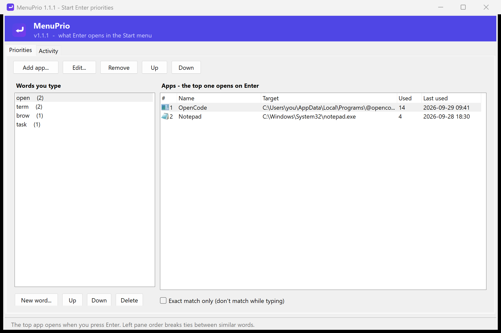

# MenuPrio


Press **Enter** in the Windows Start menu and get the app *you* meant — not the
one Windows ranked first.

MenuPrio is a small Windows tray app that decides what Enter does while you
type in the Start menu / search. It watches what you type, learns what you
actually open, and gives you a drag & drop priority list.

```
You type:  o      op     ope    open
You get:   OpenCode (because "open" is your word for it)
```

Windows only matches its own opaque ranking; MenuPrio matches **while you type**
and lets you choose the winner with the left pane.

## Download

Grab **MenuPrio.exe** from the [latest release](https://github.com/BrutalBotX/menuprio/releases/latest) —
a single file, no installer, no runtime download (it uses the .NET Framework
that is part of Windows 10/11). Run it and the tray icon appears.

> Windows may show a SmartScreen prompt because the exe is unsigned:
> *More info -> Run anyway*.

## Features

- **Typing-along matching** — a stored word matches any beginning of it:
  typing `o`, `op`, `ope`, `open` all use the "open" rule.
- **Learns from observation** — whatever opens (MenuPrio's own launches,
  Windows' default action, arrow-key picks, mouse clicks) is recorded under
  the text you typed.
- **Drag & drop priorities** — the top item in the right pane is what Enter
  opens. Reorder by dragging, or use Up/Down.
- **Left pane decides ambiguous prefixes** — with `open` and `opa` both stored,
  typing `o` or `op` is ambiguous; whichever word sits higher in the left pane
  wins. Drag it there.
- **Activity log** — a chronological history of *typed -> opened*.
- **Pause toggle**, start with Windows, single-instance tray app.
- **Tiny idle footprint** — the tray icon/menu are native Win32 and the history
  format is hand-rolled JSON, so neither WinForms nor System.Web is loaded until
  you open the window. Idle: ~8 MB working set (trimmed), ~18 MB private.
- **Crisp on scaled displays** — the window is DPI-aware and scales its layout
  (tested at 200%) instead of being bitmap-stretched.
- No admin rights, no runtime to install: compiles against the .NET Framework
  that ships with Windows.

## Install / build

Requirements: Windows 10/11 and either Visual Studio 2022 (any edition) or
Visual Studio Build Tools with the C# build tools installed.

```
git clone https://github.com/BrutalBotX/menuprio.git
cd menuprio
build.cmd
```

`build.cmd` produces:

| file | what it is |
| --- | --- |
| `MenuPrio.exe` | the tray app (icon embedded) |
| `MenuPrioTest.exe` | console self-test (`--selftest`, 30+ checks) |

Run `MenuPrio.exe`. A tray icon appears; double-click it (or right-click ->
**Priorities...**) to open the UI.

```
MenuPrio.exe              run in the tray
MenuPrio.exe --ui         start with the Priorities window open
MenuPrio.exe --console    also show a live log window
MenuPrio.exe --verbose    log every buffered keystroke too
```

### Cutting a release

```
powershell -ExecutionPolicy Bypass -File tools\publish-release.ps1
```

Builds the exe, reads the version from `src/AssemblyInfo.cs`, packs
`MenuPrio.exe` + `README.md` + `LICENSE` into `dist\MenuPrio-<version>-win.zip`
and publishes a GitHub release with both assets. It reuses the credentials git
already has for `origin` (nothing new to log in to). Optional parameters:
`-Version 1.2.0`, `-Notes "..."`, `-SkipBuild`.

## How matching works

For every stored word ("group"), MenuPrio matches in this order:

| rank | rule | example |
| --- | --- | --- |
| 1 | exact | typed `open`, word `open` |
| 2 | word starts with what you typed | typed `op`, word `open` |
| 3 | what you typed starts with the word | typed `opencode`, word `open` |

When several words match at the same rank (typing `o` with `open` and `opa`
stored), the **left pane order** decides: the word closest to the top wins.

`Exact match only` in the UI disables ranks 2 and 3 for a word.

The right pane order decides which *app* wins when a word matches: the top app
is launched.

## Priorities window



*The top app under a word is what Enter opens. The Activity tab keeps the log:*


- **Left pane** — every typed text, in priority order. Drag to reorder.
  `Up`/`Down`/`Delete` buttons below. `[exact]` marks exact-only words.
- **Right pane** — apps recorded for the selected word.
  - **Enter opens the top row.**
  - Drag rows to reorder, or Up/Down.
  - `Add app...`, `Edit...` (name, target, arguments, working dir), `Remove`.
  - Drag files from Explorer into the list to add them.
  - `Used` / `Last used` columns help you decide.
- **Activity tab** — history of typed text and what opened, with a source:
  - `menu` — MenuPrio intercepted Enter and launched it
  - `observed` — Windows (or a manual pick / click) launched it
  - `rule` — imported from the old `rules.ini`
  - `manual` — added by hand in the UI
- **Pause interception** — stops intercepting and observing (also in the tray
  menu).

## Files

| path | purpose |
| --- | --- |
| `%APPDATA%\MenuPrio\history.json` | words, apps, priority order, activity log |
| `%APPDATA%\MenuPrio\config.ini` | which windows count as the launcher |
| `%LOCALAPPDATA%\MenuPrio\menuprio.log` | log (tray -> Open log) |

### Migrating from rules.ini

If `%APPDATA%\MenuPrio\rules.ini` exists (the old format), it is imported into
`history.json` on first run: one rule becomes the first app of its word,
`prefix` rules keep matching as usual. After that, rules.ini is no longer read;
if you edited it, use tray -> **Import rules.ini** to merge again.

## How it works

- A `WH_KEYBOARD_LL` hook (installed only in the MenuPrio process) keeps a
  buffer of what you type while a launcher window is in the foreground
  (`StartMenuExperienceHost`, `SearchHost`, `SearchUI`).
- On Enter, if a word matches, MenuPrio swallows the key, sends Escape to close
  Start, and launches the top app.
- A small observer watches what comes to the foreground after the launcher
  closes. Freshly started processes are recorded under the word you typed;
  switching back to an already running window is ignored.
- Manual picks (arrow keys) are never overridden — interception is skipped for
  that Enter; the chosen app is recorded instead.

### Memory

The idle process is deliberately small: the tray window, popup menu and message
loop are native Win32 (no `System.Windows.Forms`), `history.json` is written by
a small built-in JSON writer/reader (no `System.Web.Extensions`), and even
`System.Core` stays unloaded. WinForms and System.Drawing only load when you
open the Priorities window, and the process collects garbage and trims its
working set every minute and right after the window closes.

Measured on Windows 11 (200% scaling): idle **~4-8 MB** working set (private
working set as shown by Task Manager), **~19 MB** private bytes; a bare .NET
Framework exe that does nothing measures ~2 MB / ~9 MB, so there is not much
left to win without leaving the .NET runtime.

## Known limitations

- The visible Start list is not reordered (Windows does not allow that); only
  Enter's action changes.
- The typed-text buffer tracks normal typing and Backspace. Mouse text edits or
  pasting inside the search box can desync it; IME/dead-key input is not
  handled.
- Observation is heuristic: apps that were already running can be missed, and
  elevated apps sometimes expose only their process name — edit the Target in
  the UI to fix that.
- Typing `o` and pressing Enter is now intentional: with a word stored, the
  prefix is a hit. Use `Pause interception` or `Exact match only` if that is
  not what you want.

## Uninstall

1. Tray -> `Start with Windows` (off), then tray -> `Exit`.
2. Delete `MenuPrio.exe` (and the folder you built it in).
3. Optionally delete `%APPDATA%\MenuPrio` and `%LOCALAPPDATA%\MenuPrio`.

## Logo

`assets/menuprio.png` / `assets/menuprio.ico` are generated by
`tools/make-icon.ps1` (PowerShell + System.Drawing, reproducible).

## License

MIT — see [LICENSE](LICENSE).
